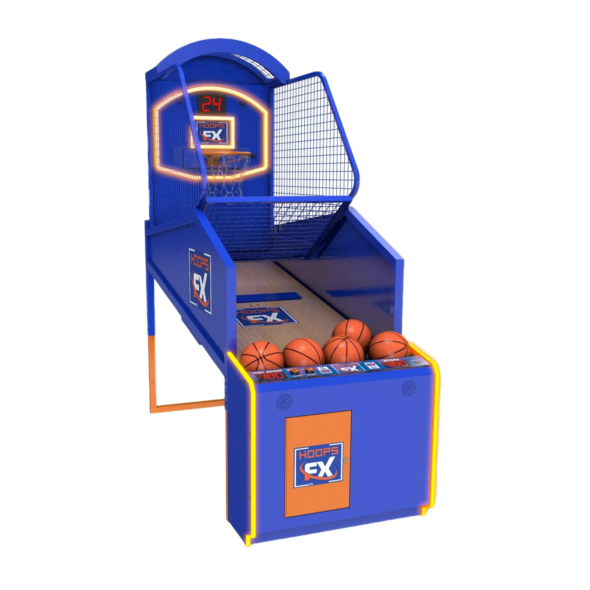
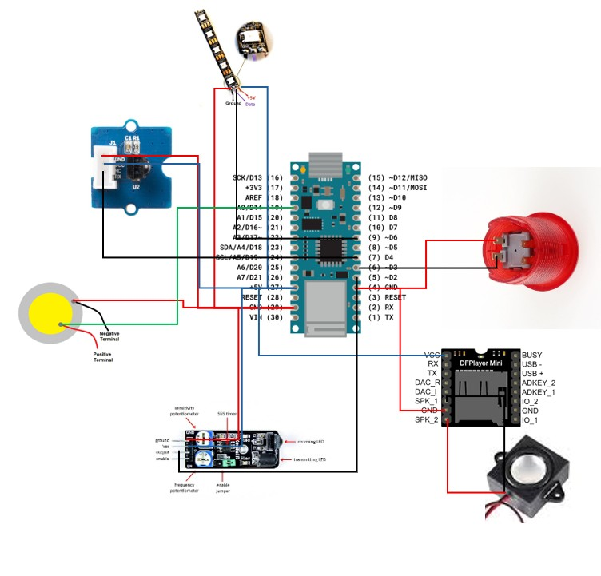

# Arduino Basketball Score Tracker 🏀

> Een Arduino-project dat scores registreert met behulp van een IR-sensor, piezo-sensor en visuele/audio feedback via NeoPixels en een DFPlayer Mini.

---

## 📖 Inhoudstafel
1. [Overzicht](#-overzicht)
2. [Benodigdheden](#-benodigdheden)
3. [Bedradingsschema](#-bedradingsschema)
4. [Installatie](#-installatie)


---

## 📌 Overzicht
Dit project is ontwikkeld in het kader van het vak **Emerging Technologies**.  
Het doel is om automatisch basketball-scores te registreren.  

**Functies:**
- IR-beam detecteert of een bal door de ring gaat.
- Piezo-sensor meet of de bal het bord raakt.
- Scores mét en zonder bord worden apart geteld.
- NeoPixels tonen de scorestatus.
- DFPlayer Mini speelt geluidseffecten af bij score of miss.
- Knop die 5 second timer start wanneer je kan werpen.

---

## 🔧 Benodigdheden
- Arduino Nano 33 IoT  
- Startknop (EG STARTS 5X)  
- IR-sensoren: KY-032 + Grove IR ontvanger  
- Piezo-sensor    
- NeoPixel stick (8 LEDs)  
- DFPlayer Mini + 8Ω speaker  
- Condensator (1000 µF, 6.3V of hoger)  
- Weerstand (470Ω voor NeoPixel data-lijn)  
- Breadboard en jumper wires  

---

## 🪛 Bedradingsschema


**Belangrijkste aansluitingen:**

- **Startknop (EG STARTS 5X)**  
  - Pin 1 → D3 (platePin)  
  - Pin 2 → GND  

- **KY-032 IR-sensor (zender)**  
  - VCC → 5V  
  - GND → GND  
  - DO → D2  

- **Grove IR ontvanger**  
  - VCC → 5V  
  - GND → GND  
  - SIG → D4  

- **Piezo-sensor**  
  - Anode (+) → A0  
  - Kathode (-) → GND  

- **NeoPixel stick**  
  - VCC → 5V  
  - GND → GND  
  - Data → D6 (via 470Ω weerstand)  
  - Extra: 1000 µF condensator tussen VCC en GND  

- **DFPlayer Mini**  
  - VCC → 5V  
  - GND → GND  
  - RX → D10 (Arduino TX via SoftwareSerial)  
  - TX → D11 (Arduino RX via SoftwareSerial)  
  - SPK1 → Speaker +  
  - SPK2 → Speaker –  

---

## 💻 Installatie
1. Clone deze repository:
   ```bash
   git clone https://github.com/cedricwatteyn/opkomende_tech.git
